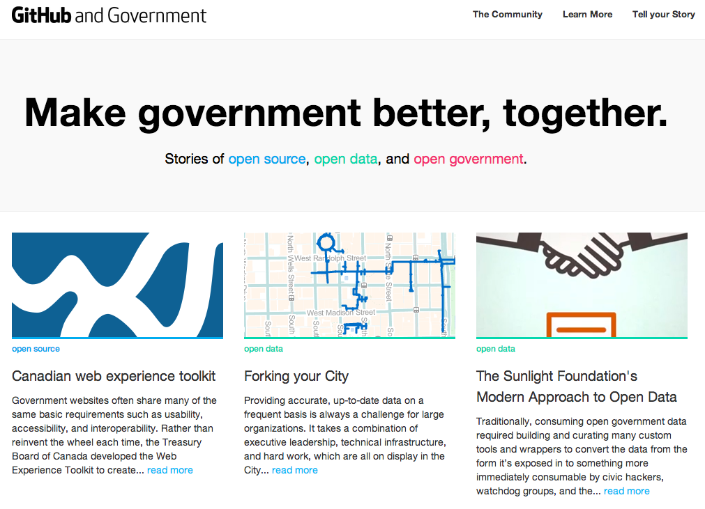

# GitHub for Government

*The [government.github.com](http://gov.githubapp.com) of the future, here today.*

## Vision

A government-centric GitHub microsite that lives at [government.github.com](http://gov.github.com) and serves to educate and inspire government employees and civic hackers as to the awesomeness that we all know as The GitHub Way&trade;.

### High-level ideas:

* Excite and encourage government adoption of The GitHub Way&trade;
* Educate public servants about the open source ethos and its benefits
* High-level disambiguation about what GitHub is and what it does
* Showcase use cases to give successful agencies some love (and excite the developer community)
* FAQ / Best Practices (ideally collaborative) to lower barrier to getting started

### Huh? What's this GitHub Way thing?

The GitHub Way is an opinionated workflow. It's the best way for communities large and small to work together to tackle shared challenges. It stems from the belief that open is better than closed, and shared is better than owned. That erecting technical and administrative constraints to hinder the free flow of information simply serves to introduce friction and decrease the overall efficiency of the system. The GitHub Way may trace its routes back to open source, but that doesn't necessarily mean that projects must be public. Many companies (including GitHub) rely on this model of open collaboration every day. The GitHub way simply acknowledges the reality that creating stuff is a team sport. For more background see:

* http://tomayko.com/writings/adopt-an-open-source-process-constraints
* http://tomayko.com/writings/management-style

### Are you selling GitHub.com? GitHub Enterprise? What gives?

The site should serve to introduce government employees and civic hackers to the concepts and workflows that embody The GitHub Way, not a particular product, paid or otherwise. It should, at a very high level, help the reader to distinguish between what GitHub.com and GitHub Enterprise offers, and, most fundamentally answer the question "what is GitHub"?

**Prior art:**

* https://github.com/github/government
* http://www.google.com/enterprise/apps/government/
* http://aws.amazon.com/federal/
* http://ben.balter.com/open-source-for-government
* http://vip.wordpress.com/spotlight/government/

See [github/gov/#2](https://github.com/github/gov/issues/2) for more background. The goal is the site to be entirely static (Jekyll/GitHub Pages) and open source so governmenty types can contribute.

This could also serve as a vehicle to crowd source a collaborative list of government organizations on GitHub.

## Viewing

Temporary internal staging server: http://gov.githubapp.com

## Deploying

`/deploy gov` (for now)

(eventually will be GitHub pages)

## Requirements

* Jekyll (ruby)
* CoffeeScript (node, npm)

## Setup Locally

1. `Git clone https://github.com/github/gov.github.com.git`
2. `cd gov.github.com`
3. `script/bootstrap`
4. `script/server`
5. `open http://localhost:4000`
6. Profit.

## Roadmap

Check out the [current issues](https://github.com/github/gov.github.com/issues) to see what's in the pipeline.

## How to contribute

1. Create a new feature branch
2. Push changes
3. Submit a pull request

## Compiling

The site uses CoffeeScript to generate the `/community` page dynamically. To recompile the CoffeeScript, simply `script/build`. *Note:* This will fire automatically before `script/server` as well.

## Contributing to the agency list

Simply edit the list in `_config.yml`. Everything else is dynamic.

## Jekyll Auth

For information on authentication, see the [Jekll-auth readme](https://github.com/benbalter/jekyll-auth)
